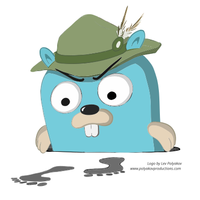

<p align="center">
  <picture>
    <source
      media="(prefers-color-scheme: dark)"
      srcset="./assets/profile-hero/dark.svg"
    />
    <source
      media="(prefers-color-scheme: light)"
      srcset="./assets/profile-hero/light.svg"
    />
    
  </picture>
</p>

<p align="center">
  <a href="https://www.linkedin.com/in/govind-charpe">
    
  </a>
  <a href="mailto:govind.charpe16@gmail.com">
    
  </a>
  <a href="https://github.com/search?q=is%3Apr+author%3Agcharpe1604+is%3Amerged&type=pullrequests">
    
  </a>
  <a href="https://github.com/gcharpe1604?tab=repositories">
    
  </a>
</p>

<p align="center">
  <strong>11+ merged upstream PRs</strong>
  · CNCF Harbor CLI
  · Sugar Labs Music Blocks
  · Go & backend systems
</p>

## About

Computer Science student focused on **Go, backend systems, cloud-native engineering, and open source**. I build developer tools and full-stack products, and I am open to software engineering internships and mentorship programs.

## Open Source

<h3>
  CNCF Projects
  
</h3>

<table>
  <tr>
    <td width="110" align="center" valign="middle">
      
    </td>
    <td valign="middle">
      <strong>Harbor CLI</strong><br />
      Go CLI contributions covering safer authentication, reliable error
      handling, configuration flows and registry-maintenance commands.
      <br /><br />
      <a href="https://github.com/goharbor/harbor-cli/pulls?q=is%3Apr+author%3Agcharpe1604">
        View contributions →
      </a>
    </td>
  </tr>

  <tr>
    <td width="110" align="center" valign="middle">
      
    </td>
    <td valign="middle">
      <strong>Jaeger UI</strong><br />
      Graph-state synchronization, TypeScript safety and UI refactoring.
      <br /><br />
      <a href="https://github.com/jaegertracing/jaeger-ui/pulls?q=is%3Apr+author%3Agcharpe1604">
        View contributions →
      </a>
    </td>
  </tr>
</table>

<h3>Sugar Labs</h3>

<table>
  <tr>
    <td width="110" align="center" valign="middle">
      
    </td>
    <td valign="middle">
      <strong>Music Blocks</strong><br />
      Performance, asynchronous reliability, error handling,
      browser lifecycle and user-experience improvements.
      <br /><br />
      <a href="https://github.com/sugarlabs/musicblocks/pulls?q=is%3Apr+author%3Agcharpe1604+is%3Amerged">
        9 merged PRs →
      </a>
    </td>
  </tr>
</table>

## Featured Work

### GitAnalyzer

A developer tool that scores commit-message quality, identifies repository-wide patterns, and turns Git history into actionable feedback.

- Rule-based quality scoring and repository insights
- AI-assisted commit rewriting with provider fallback
- GitHub API integration, Supabase authentication and saved analysis history

**Stack:** React, TypeScript, Vite, Supabase and GitHub REST API

<p>
  <a href="https://gitanalyzer-ai.netlify.app/">
    
  </a>
  <a href="https://github.com/gcharpe1604/gitanalyzer">
    
  </a>
</p>

### OpenTrack — In Development

A full-stack contribution tracker for repositories, pull requests, and contributor activity.

**Stack:** React, Node.js, Express and PostgreSQL

<p>
  <a href="https://github.com/gcharpe1604/opentrack">
    
  </a>
  
</p>

## GitHub Activity

<p align="center">
  <picture>
    <source
      media="(prefers-color-scheme: dark)"
      srcset="./assets/profile/github-streak-dark.svg"
    />
    <source
      media="(prefers-color-scheme: light)"
      srcset="./assets/profile/github-streak-light.svg"
    />
    
  </picture>
</p>

<p align="center">
  <picture>
    <source
      media="(prefers-color-scheme: dark)"
      srcset="https://github-readme-activity-graph.vercel.app/graph?username=gcharpe1604&amp;bg_color=0B0F15&amp;color=8E98A6&amp;title_color=AFC3D5&amp;line=7897B3&amp;point=D1B178&amp;area=true&amp;area_color=4E708F&amp;hide_border=true&amp;radius=12&amp;days=38&amp;custom_title=Contribution%20Activity"
    />
    <source
      media="(prefers-color-scheme: light)"
      srcset="https://github-readme-activity-graph.vercel.app/graph?username=gcharpe1604&amp;bg_color=F8FAFC&amp;color=475569&amp;title_color=4E708F&amp;line=4E708F&amp;point=A47A3C&amp;area=true&amp;area_color=AFC3D5&amp;hide_border=true&amp;radius=12&amp;days=38&amp;custom_title=Contribution%20Activity"
    />
    
  </picture>
</p>

## Current Focus

```text
Learning       Go, backend architecture and distributed systems
Building       Developer tools, APIs and cloud-native services
Contributing   CNCF Harbor CLI, Sugar Labs and Jaeger UI
```

## Core Stack

**Languages**

<p>
  
  
  
  
</p>

**Frontend**

<p>
  
  
</p>

**Backend & Data**

<p>
  
  
  
  
  
  
</p>

**Infrastructure & Tools**

<p>
  
  
  
</p>

## Connect

Open to software engineering internships, open-source mentorships, and backend or developer-tooling collaborations.

<p align="center">
  <a href="https://www.linkedin.com/in/govind-charpe">
    
  </a>
  <a href="mailto:govind.charpe16@gmail.com">
    
  </a>
</p>

<p align="center">
  <picture>
    <source
      media="(prefers-color-scheme: dark)"
      srcset="./assets/profile/github-contribution-grid-snake-dark.svg"
    />
    <source
      media="(prefers-color-scheme: light)"
      srcset="./assets/profile/github-contribution-grid-snake.svg"
    />
    
  </picture>
</p>
